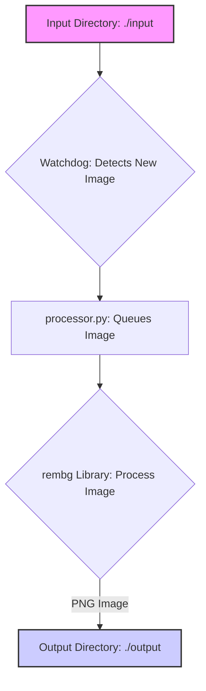

# 🖼️ Background Remover Service

A simple microservice for automatically removing backgrounds from images using the powerful [rembg](https://github.com/danielgatis/rembg) library.

## ✨ Purpose

This service watches a designated input directory for new image files. When an image appears, it swiftly processes it to remove the background and saves the transparent result to an output directory.

## 🚀 Features

-   📁 Monitors an input directory for new images (`.jpg`, `.jpeg`, `.png`, `.heic`).
-   🧠 Uses the `rembg` library with configurable AI models (`u2net`, `u2netp`, etc.).
-   💾 Saves processed images transparently as PNG files to an output directory.
-   🚶‍♂️ Handles image processing sequentially as files are detected.
-   ⚙️ Configuration managed easily via environment variables (`.env` file).
-   🍏 Supports HEIC image format (requires `pillow-heif`).

## ⚙️ Workflow Overview

The service follows a straightforward process:



## 📋 Prerequisites

-   **Operating System:** macOS, Linux, or Windows (WSL2 recommended).
-   **Git:** Required for cloning (needed *before* running install scripts).
-   **Docker & Docker Compose:**
    -   Docker Engine or Docker Desktop installed and **running**.
    -   Docker Compose V2 (`docker compose`) recommended. The install scripts check for `docker compose` or the legacy `docker-compose`.

## 🛠️ Setup & Installation

Choose the method that best suits your needs:

### Standard Setup (Within Monorepo)

Use this if you've cloned the main `carousel-fresh` monorepo.

1.  **Navigate to Service Directory:**
    ```bash
    cd path/to/carousel-fresh/services/bg-remover
    ```

2.  **Run Local Installation Script:**
    This script handles prerequisites, environment setup (`.env`), Docker build, and starts the service.
    ```bash
    # Run from the services/bg-remover directory
    bash scripts/install.sh
    ```
    Follow any guidance provided by the script if dependencies are missing.

### Alternative: Quick Install (Standalone Service Only)

Use this if you *only* want this service, separate from the monorepo.

```bash
# Run this in the directory where you want the service folder created
curl -sSL https://raw.githubusercontent.com/hringekjan/bg-remover/main/scripts/quick_install.sh | bash
```

**Notes for Quick Install:**
*   Creates a new directory named `bg-remover-service`.
*   Requires `curl` or `wget`.
*   Checks for Docker/Docker Compose.
*   This installation is **not** part of the monorepo structure.

## 🔧 Configuration

Configuration is managed via the `.env` file located in the service directory (`services/bg-remover` or `bg-remover-service`). Create it from `.env.example` if it doesn't exist.

Key variables:

```dotenv
# .env

# Directory monitored for new images (relative to the container's /app directory)
INPUT_DIR=./input

# Directory where processed images are saved (relative to the container's /app directory)
OUTPUT_DIR=./output

# Model for background removal (e.g., u2net, u2netp, u2net_human_seg, silueta)
# See rembg docs: https://github.com/danielgatis/rembg#models
REMBG_MODEL=u2net

# Optional: Alpha matting settings (uncomment to enable)
# ALPHA_MATTING=true
# ALPHA_MATTING_FOREGROUND_THRESHOLD=240
# ALPHA_MATTING_BACKGROUND_THRESHOLD=10
# ALPHA_MATTING_ERODE_SIZE=10

# Optional: Set umask for created files (e.g., 002 for group write)
# UMASK=002

# Optional: Log level (DEBUG, INFO, WARNING, ERROR)
LOG_LEVEL=INFO
```

Adjust these values as needed before starting the service.

## ▶️ Usage

1.  **Start the Service:**
    Navigate to the service directory (`services/bg-remover` or `bg-remover-service`) and run:
    ```bash
    # Use 'docker compose' or 'docker-compose' depending on your setup
    docker compose up --build -d
    ```
    The `--build` flag ensures the image is up-to-date, and `-d` runs it in the background.

2.  **Process Images:**
    Simply copy or move your image files (`.jpg`, `.jpeg`, `.png`, `.heic`) into the `input` directory (e.g., `services/bg-remover/input`).

3.  **Retrieve Results:**
    The processed images (with transparent backgrounds, saved as PNG) will appear in the `output` directory (e.g., `services/bg-remover/output`).

4.  **View Logs:**
    To see what the service is doing or troubleshoot issues:
    ```bash
    docker compose logs -f
    ```
    Press `Ctrl+C` to stop following the logs.

5.  **Stop the Service:**
    ```bash
    docker compose down
    ```
    This stops and removes the containers defined in the `docker-compose.yml` file.