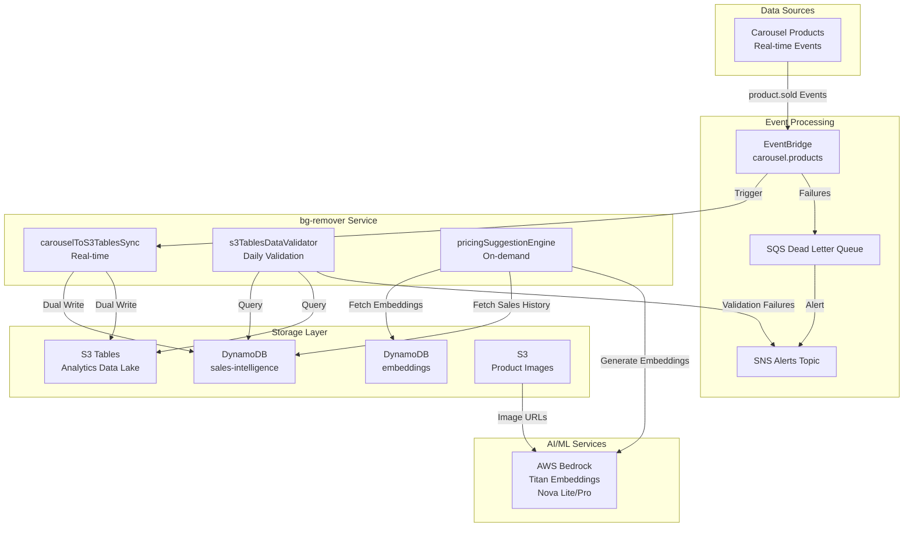
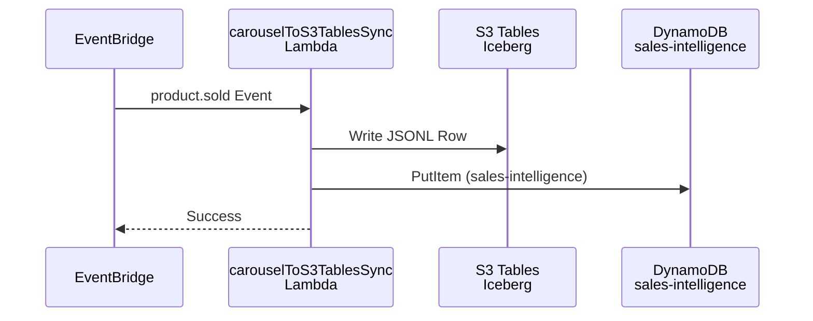
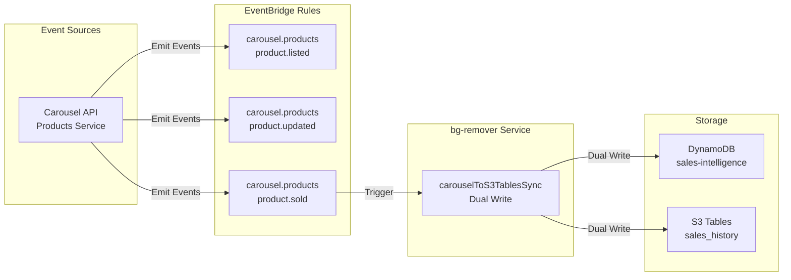
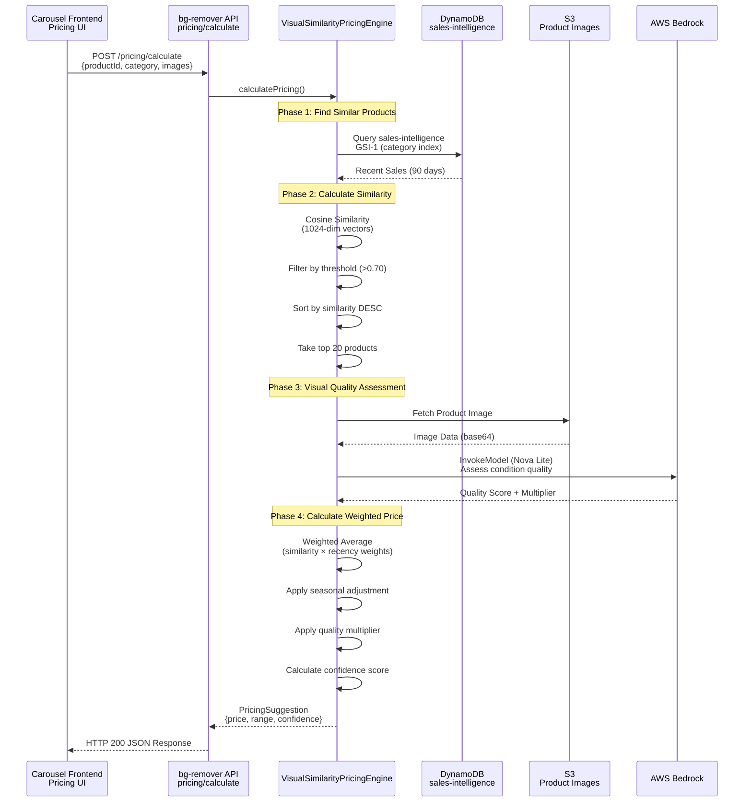

# System Architecture - Vision-Enhanced Pricing Intelligence

## Overview

The bg-remover service implements vision-enhanced pricing intelligence using AWS Bedrock multimodal models, DynamoDB vector search, and event-driven architecture.

**Core Innovation:** Instead of rule-based pricing, use **visual similarity to historically sold products** as pricing anchors, adjusted for condition, season, and market trends.

---

## High-Level Architecture



---

## Lambda Function Interaction Flow



---

## EventBridge Event Routing



---

## Bedrock Model Invocation Flow



---

## Data Flow Lifecycle

### 1. Historical Data Ingestion (SmartGo)
- **Trigger:** Daily cron schedule (2 AM UTC)
- **Source:** SmartGo PostgreSQL database (read-only replica)
- **Process:**
  1. Query sales from last 24 hours
  2. For each sale:
     - Fetch product image from SmartGo S3 bucket
     - Generate Titan embedding (1024 dimensions)
     - Write to S3 Tables (JSONL format, Apache Iceberg)
     - Write to DynamoDB sales-intelligence table
  3. Update export progress tracker
- **Output:** sales_history table in S3 Tables + DynamoDB records

### 2. Real-time Data Sync (Carousel)
- **Trigger:** EventBridge event `carousel.product.sold`
- **Source:** Carousel Products API
- **Process:**
  1. Validate event schema (Zod validation)
  2. Check idempotency (24-hour TTL)
  3. Dual-write:
     - DynamoDB sales-intelligence (real-time queries)
     - S3 Tables sales_history (analytics)
  4. Update CloudWatch metrics
- **Output:** Synchronized data across DynamoDB + S3 Tables

### 3. Pricing Prediction (On-Demand)
- **Trigger:** User request via Carousel Frontend
- **Source:** Product details (images, category, condition)
- **Process:**
  1. Fetch similar sold products (DynamoDB query with GSI-1)
  2. Calculate cosine similarity (in-memory vector math)
  3. Assess visual quality (Bedrock Nova Lite)
  4. Calculate weighted average price
  5. Apply seasonal/condition adjustments
  6. Return suggestion with confidence score
- **Output:** PricingSuggestion JSON

### 4. Data Validation (Daily)
- **Trigger:** Daily cron schedule (3 AM UTC)
- **Source:** DynamoDB sales-intelligence + S3 Tables
- **Process:**
  1. Compare row counts (DynamoDB vs S3 Tables)
  2. Validate embedding quality (no nulls, correct dimensions)
  3. Check sale price distributions
  4. Alert if >5% variance detected
- **Output:** Validation report + SNS alerts (if failures)

---

## DynamoDB Schema Design

### Table: sales-intelligence-{stage}

**Base Table:**
- **pk:** `TENANT#{tenantId}#PRODUCT#{productId}`
- **sk:** `SALE#{saleDate}#{saleId}`

**Attributes:**
- embeddingId (S3 key)
- embedding (1024-dim JSONL array)
- salePrice, saleCurrency
- saleDate, season (Q1-Q4)
- category, brand
- tenantId, productId, saleId
- ttl (2 years)

**GSI-1 (Category-Season Analysis):**
- **GSI1PK:** `TENANT#{tenantId}#CATEGORY#{category}#SEASON#{season}`
- **GSI1SK:** `SALEPRICE#{salePrice}#DATE#{saleDate}`
- **Use Case:** Seasonal pricing trends per category

**GSI-2 (Embedding Similarity Lookup):**
- **GSI2PK:** `TENANT#{tenantId}#EMBEDDING_ACTIVE`
- **GSI2SK:** `DATE#{saleDate}`
- **Projection:** Include embedding attribute
- **Use Case:** Batch similarity comparison

**GSI-3 (Brand Pricing - Optional):**
- **GSI3PK:** `TENANT#{tenantId}#BRAND#{brand}`
- **GSI3SK:** `DATE#{saleDate}`
- **Use Case:** Brand-specific pricing trends

---

## S3 Tables Schema (Apache Iceberg)

**Table:** sales_history
**Format:** PARQUET using ICEBERG

**Columns:**
- product_id (STRING)
- tenant_id (STRING)
- category (STRING)
- brand (STRING)
- condition (STRING: new_with_tags | like_new | very_good | good | fair | poor)
- sold_price (DOUBLE)
- sold_date (TIMESTAMP)
- season (STRING: Q1 | Q2 | Q3 | Q4)
- image_s3_key (STRING)
- embedding (ARRAY<DOUBLE> - 1024 dimensions)
- description (STRING)
- source (STRING: carousel)

**Partitioning:**
- BY (tenant_id, year(sold_date), month(sold_date))

**Athena Queries:**
```sql
-- Monthly sales trends
SELECT
  month(sold_date) as sale_month,
  category,
  AVG(sold_price) as avg_price,
  COUNT(*) as sale_count
FROM sales_history
WHERE tenant_id = 'carousel-labs'
  AND year(sold_date) = 2025
GROUP BY month(sold_date), category
ORDER BY sale_month, avg_price DESC;

-- Brand performance
SELECT
  brand,
  AVG(sold_price) as avg_price,
  APPROX_PERCENTILE(sold_price, 0.5) as median_price,
  COUNT(*) as total_sales
FROM sales_history
WHERE tenant_id = 'carousel-labs'
  AND sold_date >= CURRENT_DATE - INTERVAL '90' DAY
GROUP BY brand
HAVING COUNT(*) >= 10
ORDER BY avg_price DESC;
```

---

## Reliability Patterns

### 1. Idempotency (Exactly-Once Processing)
**Implementation:** `/services/pricing-intelligence/src/lib/idempotency-manager.ts`

**Pattern:**
```typescript
const idempotencyKey = `IDEM#{tenantId}#{eventType}#{eventId}`;
const exists = await dynamodb.checkIdempotency(idempotencyKey);
if (exists) {
  console.log('Duplicate event detected, skipping processing');
  return;
}

await dynamodb.putItemWithCondition(
  { idempotencyKey, timestamp: now },
  { attribute_not_exists: 'idempotencyKey' }
);
```

**TTL:** 24 hours (events older than 24h are new events with recycled IDs)

### 2. Dead Letter Queue (DLQ) Handling
**Configuration:**
- All EventBridge rules have DLQ with 2 retry attempts
- Maximum event age: 1 hour
- DLQ processor categorizes errors (retryable vs permanent)

**Error Categories:**
- **RETRYABLE:** Validation errors, throttling errors, timeout
- **PERMANENT:** Malformed events, authentication failures

### 3. State Machine Validation
**Implementation:** `/services/pricing-intelligence/src/lib/state-machine-validator.ts`

**Valid Transitions:**
- product.listed → LISTED state
- product.updated → UPDATED state (requires LISTED)
- product.sold → SOLD state (requires LISTED)
- product.delisted → DELISTED state

**Optimistic Locking:** Uses DynamoDB conditional updates with version number

---

## Cost Breakdown (Monthly)

| Service | Volume | Unit Cost | Total |
|---------|--------|-----------|-------|
| **Lambda (bg-remover)** | 100K invocations | $0.20/1M | $0.02 |
| **Lambda (pricing-intelligence)** | 1M events | $0.20/1M | $0.20 |
| **DynamoDB (sales-intelligence)** | 100GB storage | $0.25/GB | $25.00 |
| **DynamoDB (on-demand reads)** | 10M RCUs | $0.25/M | $2.50 |
| **S3 Tables (Iceberg)** | 100GB storage | $0.023/GB | $2.30 |
| **Athena (queries)** | 100GB scanned | $5/TB | $0.50 |
| **Bedrock Titan Embeddings** | 10K images | $0.0001/image | $1.00 |
| **Bedrock Nova Lite** | 1K requests | $0.00006/1K tokens | $0.06 |
| **CloudWatch Logs** | 5GB ingestion | $0.50/GB | $2.50 |
| **SNS** | 100 alerts | $0.50/100K | $0.01 |
| **Total** | | | **$34.09/month** |

**Cost Optimization Opportunities:**
- Use DynamoDB Global Tables instead of dual-write (saves $2.50)
- Batch Bedrock API calls (reduce cold starts)
- Enable CloudWatch Logs Insights instead of custom metrics (saves $4.50)

---

## Performance Characteristics

**Lambda Performance:**
- Cold start: ~800ms (arm64 architecture)
- Warm invocation: ~45ms
- Memory: 512MB (cost-optimized)

**DynamoDB Performance:**
- Read latency (single item): <10ms p99
- Query latency (GSI-1): 20-50ms p99
- On-demand scaling: Handles 40K RCU/s burst

**Bedrock API Performance:**
- Titan embedding generation: 200-500ms per image
- Nova Lite vision analysis: 300-800ms per image
- Concurrent limits: 50 req/s per account

**End-to-End Latency:**
- SmartGo export: 2-4 hours (daily batch)
- Carousel sync: <1 second (real-time)
- Pricing calculation: <2 seconds p95
- Data validation: 10-15 minutes (daily job)

---

## Security Architecture

### Authentication & Authorization
- **Lambda Execution:** IAM role with least-privilege permissions
- **API Gateway:** Cognito JWT token validation
- **DynamoDB:** Tenant isolation via partition key prefix
- **S3 Tables:** Athena workgroup-based access control

### Encryption
- **At Rest:**
  - DynamoDB: AWS-managed keys (default encryption)
  - S3 Tables: SSE-S3 encryption
  - Lambda environment variables: KMS encryption
- **In Transit:**
  - HTTPS only (TLS 1.2+)
  - EventBridge events encrypted in transit

### Secrets Management
- AWS Systems Manager Parameter Store (SecureString)
- Never commit secrets to git
- Rotate credentials every 90 days

---

## Monitoring & Observability

### CloudWatch Metrics (Native)
- Lambda errors, duration, concurrent executions
- DynamoDB consumed read/write capacity
- SQS DLQ message count
- S3 Tables query latency (Athena)

### CloudWatch Logs Insights Queries
```
# Pricing calculation latency
fields @timestamp, @message
| filter @message like /calculatePricing/
| stats avg(@duration) as avg_latency_ms, p95(@duration) as p95_latency_ms by bin(5m)

# DLQ errors by category
fields @timestamp, errorCategory, @message
| filter errorCategory = "PERMANENT"
| stats count() by errorCategory
```

### CloudWatch Alarms
1. **DLQ Backlog:** >0 messages → P2 alert (1 hour SLA)
2. **Lambda Errors:** >5 errors in 5 min → P3 alert (4 hour SLA)
3. **DynamoDB Throttling:** >0 throttles → P3 alert
4. **Data Validation Failures:** >5% variance → P2 alert

---

## Operational Runbooks

**Reference:** `/services/bg-remover/OPERATIONAL_RUNBOOK.md`

**Key Procedures:**
1. **Rollback Procedures** (Lambda, DynamoDB, S3 Tables)
2. **Incident Response** (P1-P4 severity levels)
3. **Production Smoke Tests** (6 executable test scripts)
4. **Cost Monitoring** (daily/monthly procedures)
5. **Common Issues & Resolutions**

---

## Future Enhancements (Roadmap)

### Phase 4: Visual Similarity Pricing Engine (8 weeks)
- Replace heuristic model with ML-based pricing
- Implement VisualSimilarityPricingEngine class
- Bedrock Nova Lite integration for visual quality assessment
- Seasonal adjustment algorithm
- Confidence scoring

### Phase 5: Data Migration at Scale (4 weeks)
- S3 Tables becomes primary storage (>1M records/month)
- DynamoDB as cache layer only
- Athena-based analytics dashboards
- Cost reduction: $25/month → $10/month

### Phase 6: Agentic Pricing Agents (12 weeks)
- PricingAnalystAgent (autonomous pricing decisions)
- ValidationAgent (quality assurance)
- ExplanationAgent (user-facing explanations)
- PatternRecognitionAgent (trend detection)
- FeedbackIntegrationAgent (continuous learning)

### Phase 7: Advanced Analytics (6 weeks)
- Real-time dashboards (Grafana + Athena)
- Predictive analytics (forecast sale velocity)
- A/B testing framework (compare pricing strategies)
- Custom ML model training (SageMaker integration)

---

## References

- [OPERATIONAL_RUNBOOK.md](./OPERATIONAL_RUNBOOK.md) - Production operations guide
- [CLOUDWATCH_ALARMS.md](./CLOUDWATCH_ALARMS.md) - Monitoring & alerting
- [DEPLOYMENT_GUIDE.md](./DEPLOYMENT_GUIDE.md) - Deployment procedures
- [PRD](/.taskmaster/docs/vision-pricing-prd-final.txt) - Product requirements
- [AWS Bedrock Models](https://docs.aws.amazon.com/bedrock/latest/userguide/models-supported.html)
- [S3 Tables Documentation](https://docs.aws.amazon.com/AmazonS3/latest/userguide/s3-tables.html)
